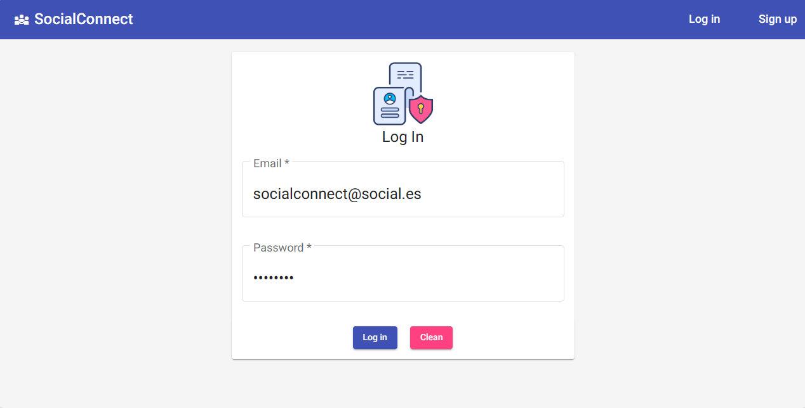
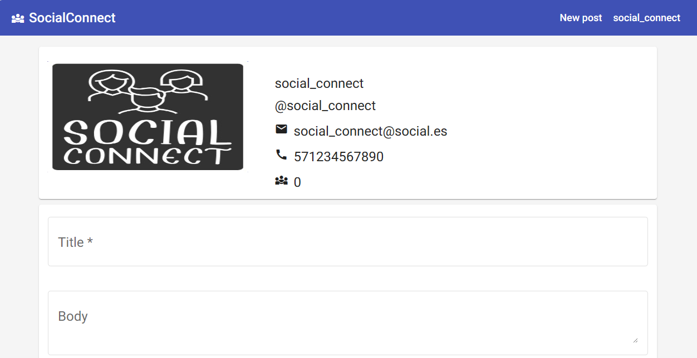
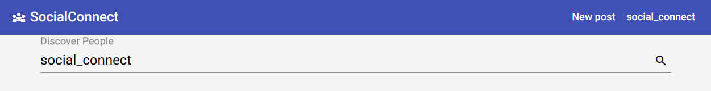

# social_connect
* Red Social implementada con Java, SpringBoot, Spring Security, JWT, Spring Data JPA, MySQL, Postman, AWS S3, AWS Lambda, Azure DataBase, Azure AppServices y Angular

* ### Registrate y prueba la versión BETA
 
URL: `https://wonderful-tree-032fd7910.3.azurestaticapps.net/`

 
## Social Connect

* Login
 

* Perfil
 

* Dashboard (Barra de busqueda)
 

