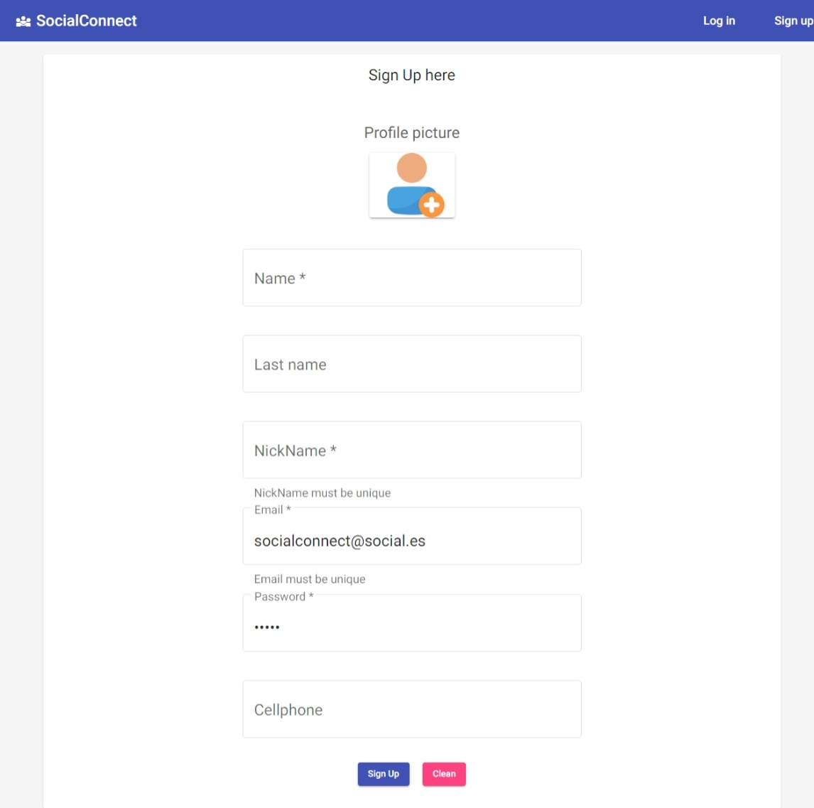

# SocialConnect
* Red Social implementada con Java, SpringBoot, Spring Security, JWT, Spring Data JPA, MySQL, Postman, AWS S3, AWS Lambda, Azure DataBase, Azure AppServices y Angular

### Registrate y prueba la versión BETA
URL: https://wonderful-tree-032fd7910.3.azurestaticapps.net/

 

* #### Registro

 

* #### Login

 

* #### Perfil

 

* #### Dashboard (Barra de busqueda)

 

#### Nota
* El código completo de la aplicación ha sido trasladado a otro repositorio, pero aún puedes registrarte y explorar.
